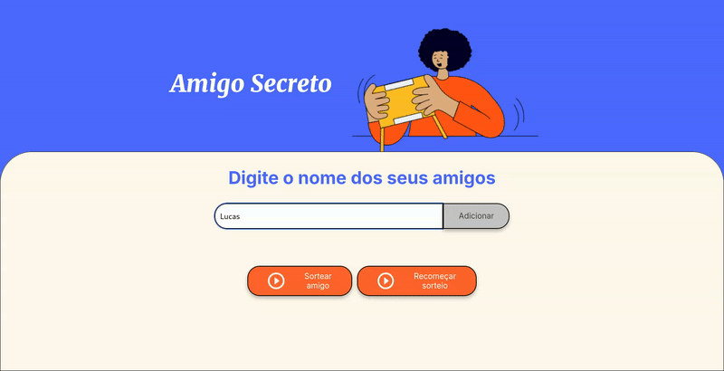

<h1 align="center"> Amigo Secreto </h1>

<p align="center">
  
</p>

<p align="center">
  
</p>

# 📜 Índice 

- [Descrição do Projeto](#descrição-do-projeto)
- [Funcionalidades](#funcionalidades)
- [Demonstração da Aplicação](#demonstração-da-aplicação)
- [Acesso ao Projeto](#acesso-ao-projeto)
- [Tecnologias Utilizadas](#tecnologias-utilizadas)
- [Contribuidores](#contribuidores)
- [Licença](#licença)

---

## 📖 Descrição do Projeto

O **Amigo Secreto** é uma aplicação simples para realizar sorteios de nomes de maneira prática e divertida. A aplicação permite que você adicione nomes à lista, sorteie aleatoriamente e reinicie o sorteio caso necessário.

Ideal para grupos de amigos, famílias ou colegas de trabalho, o projeto foi desenvolvido para ser funcional e acessível, utilizando apenas tecnologias web.

---

## 🔨 Funcionalidades

- **Adicionar amigos à lista**: Inclua os nomes dos participantes.
- **Sorteio aleatório**: Realize sorteios sem repetições até que todos os nomes sejam sorteados.
- **Reiniciar sorteio**: Limpe a lista de sorteios e recomece do zero.
- **Interface acessível**: Navegação fácil, com suporte a leitores de tela.

---

## 🎥 Demonstração da Aplicação

<p align="center">
  
</p>

---

## 📁 Acesso ao Projeto

Você pode acessar o código fonte do projeto clicando [aqui](https://github.com/Like-a-stone/Oracle-G8---ONE/tree/main/1%20-%20Iniciante%20em%20Programa%C3%A7%C3%A3o%20G8%20-%20ONE/4%20-%20Desafio-Amigo-Secreto).

Para baixar e rodar o projeto localmente:
1. Clone o repositório:
   ```bash
   git clone https://github.com/seu-usuario/amigo-secreto.git
   ```
2. Abra o arquivo `index.html` no navegador.

---

## 🛠️ Tecnologias Utilizadas

- **HTML5**: Estrutura da aplicação.
- **CSS3**: Estilização e design responsivo.
- **JavaScript**: Lógica do sorteio e manipulação do DOM.

---

## 🤝 Contribuidores

Desenvolvido por [Lucas Sampaio Santos Gomes](https://github.com/Like-a-stone).

---

## 📜 Licença

Este projeto está licenciado sob a licença da Alura. Para mais detalhes.

---

**Divirta-se utilizando o Amigo Secreto! 🎉**
